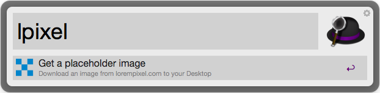
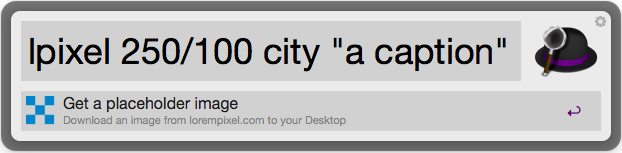

# lorempixel workflow ([Download][1])

Alfred workflow for [lorempixel.com][2]

A placeholder image from [lorempixel.com][2] will be downloaded to your Desktop

## Requirements & Installation
1. [Alfred App v2](http://www.alfredapp.com/#download)
2. [Alfred Powerpack](https://buy.alfredapp.com/)
3. [Download][1] .alfredworkflow file and double-click to import into Alfred

## Usage

    lpixel width/height type "caption"    
        

Other examples:    
    
    lpixel 500/200 
    => random image with a width of 500px and height of 200px
    
    lpixel 200/800 food
    => random food image with a width of 200px and height of 800px
    
## Arguments

`lpixel`  - Downloads a random 640x480 placeholder image of any kind from lorempixel.com  
`lpixel 500/200` - Random 500x200 image  
`lpixel 500/200 sports` - Random 500x200 sports image  
`lpixel 500/200 food "My text"` - Random 500x200 food image with text "My text"

### Important notes

The maximum width and height are respectively 1920px.

All possible types are listed on [lorempixel.com][2].

[1]: https://raw.github.com/matuzo/alfred-lorempixel-workflow/master/lorempixel.alfredworkflow
[2]: http://lorempixel.com/